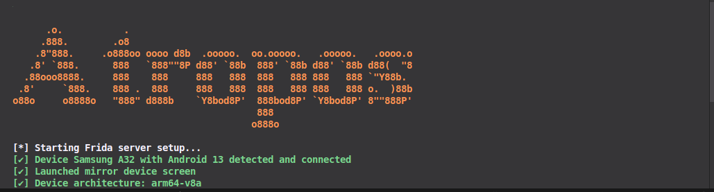
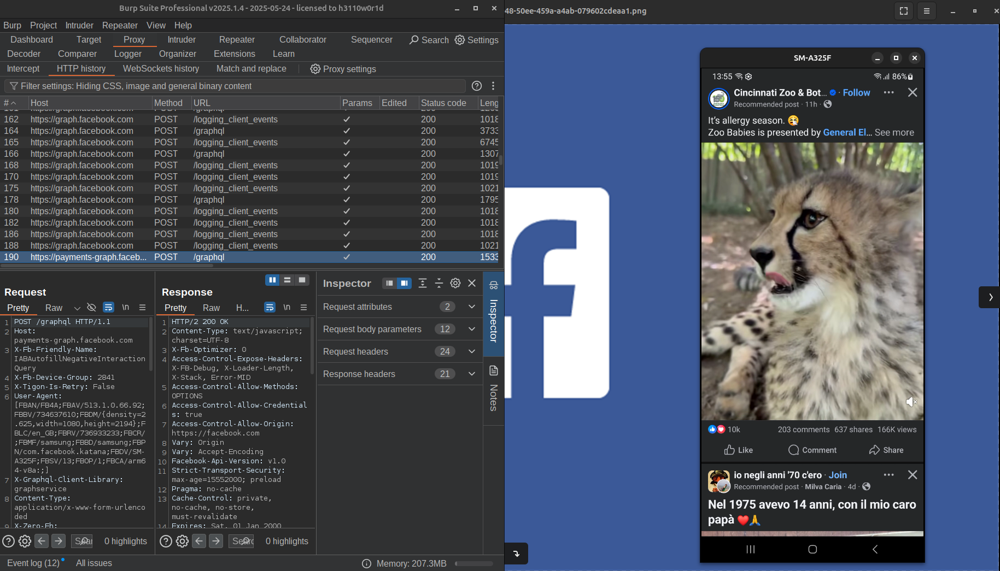
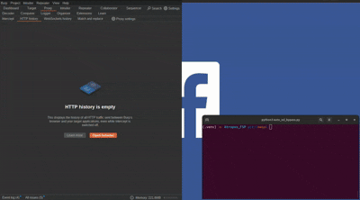

# Atropos  Android SSL Pining for Facebook

 

## 🎯 Overview

**Atropos** is an automation toolkit designed to streamline the process of reverse engineering and security testing Android applications. It combines ADB-based device management, Frida server orchestration, screen mirroring, and JavaScript-based runtime instrumentation in one unified Python script.

Ideal for scenarios like SSL pinning bypass (e.g., in the Facebook app), Atropos handles:

- Device connectivity checks
- Frida server setup tailored to device architecture
- Frida script injection (e.g., `MAIN_SSLPINING.js`)
- Visual mirroring via `scrcpy`

---

## ⚙️ Features

- 🔍 Detects connected Android devices
- 🧬 Downloads and starts correct Frida server version for device
- 📺 Launches `scrcpy` for real-time screen mirroring
- 🧪 Automatically hooks into target apps (e.g., Facebook)
- 🛠 SSL pinning bypass via Frida JS scripting
- 🎨 Command-line art and colored logging

---

## 🖼 Preview

 

---

## 🚀 Requirements

- Python 3.7+
- ADB (Android Debug Bridge)
- `scrcpy` 
- `Frida`
- Rooted Android device (or one with Frida capabilities)

### Python Dependencies

```bash
pip install -r requirements.txt
```

---

## 🔧 Usage

```
python auto_ssl_bypass.py
```
 

Make sure your device is connected and authorized via ADB before running.

### File Structure

```
.
├── auto_ssl_bypass.py
├── MAIN_SSLPINING.js
└── README.md
```

---

## 📌 Notes

* Tested on Facebook version **513.1.0** *May, 2025* and Frida version **16.5.9**
* Device architecture detection includes `arm64-v8a`, `armeabi-v7a`, `x86`, `x86_64`
* Works with <u>**rooted**</u> devices or those with a patched Frida server

🛡️ Disclaimer

This tool is for educational and ethical testing purposes only. Unauthorized use against third-party apps without permission may violate laws or terms of service.